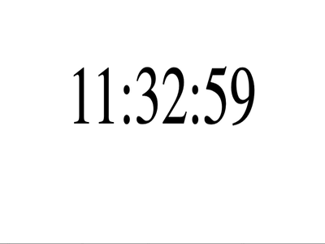

### Clicker

---

#### 1. Реализуйте компонент кликер:

- создайте компонент следующего вида:
- 
- нажимая на кнопку `+` счётчик увеличивается на 1;
- нажимая на кнопку `-` счётчик уменьшается на 1;
- нажимая кнопку `сброс` счётчик возвращается в начальное значение `0`;

Сделать по образу и подобию как мы делали на занятии, только дизайн должен быть таким же как на картинке и кнопки не должны исчезать=).

---

Финальное решение должно выглядеть так:

---

#### 2. Компонент для отображения времени: 
#####  Шаги по выполнению

- создать компонент, которые показывает статическое время
- 

Финальное решение должно выглядеть так:
--
-- 
[Общие шаги по выполнению д/з](../homework-guidelines.md)

### Читать

[Состояние компонента](https://ru.reactjs.org/docs/hooks-state.html)
[Обработка событий](https://ru.reactjs.org/docs/hooks-state.html)
[Списки](https://ru.reactjs.org/docs/lists-and-keys.html)
