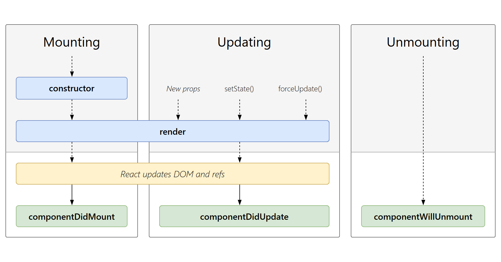

#### 1. Реализуйте компонент кликер:

- создайте компонент следующего вида:
- 
- нажимая на кнопку `+` счётчик увеличивается на 1;
- нажимая на кнопку `-` счётчик уменьшается на 1;
- нажимая кнопку `сброс` счётчик возвращается в начальное значение `0`;

Сделать по образу и подобию как мы делали на занятии, только дизайн должен быть таким же как на картинке и кнопки не должны исчезать=).

---

Финальное решение должно выглядеть так:

---

#### 2. Компонент для отображения времени: 
#####  Шаги по выполнению

- создать компонент, которые показывает статическое [время](https://developer.mozilla.org/ru/docs/Web/JavaScript/Reference/Global_Objects/Date/toLocaleTimeString)
- 
- создать state в constructor, чтобы строка времени была динамической (например `this.state = { time:  new Date().toLocaleTimeString() };`)
- в методе жизненного цикла componentDidMount сделать обновления состояние времени через 1 секунду (setInterval + setState)

---

Финальное решение должно выглядеть так:
- 

---

---

#### 3. Компонент таймер: 
#####  Как он должен работать:
- нажимая на кнопку `Start` таймер начинает свой отсчет;
- нажимая на кнопку `Stop` таймер останавливается;
- нажимая кнопку `Reset` таймер останавливается и возвращается в начальное значение `0`;

---

Финальное решение должно выглядеть так:
- 

---

#### 4. Список эмодзи:
#####  Необходимо вывести список эмоджи с названием, шаги по выполнению: 

- создать компонент `EmojiItem` должен отображать иконку эмоджи и название:

  

- создать  компонент `EmojiList` должен отображать список компонентов `EmojiItem` (этот компонент принимает как пропс массив эмодзи)
- использовать [json эмодзи](./emojiList.json)

[Общие шаги по выполнению д/з](../homework-guidelines.md)

### Читать
  

- [Состояние компонента](https://ru.reactjs.org/docs/hooks-state.html)
- [Обработка событий](https://ru.reactjs.org/docs/hooks-state.html)
- [Списки](https://ru.reactjs.org/docs/lists-and-keys.html)
- [Условный рендеринг](https://ru.reactjs.org/docs/conditional-rendering.html)
- [Формы](https://ru.reactjs.org/docs/forms.html)
- [Подъем состояния](https://ru.reactjs.org/docs/lifting-state-up.html)
