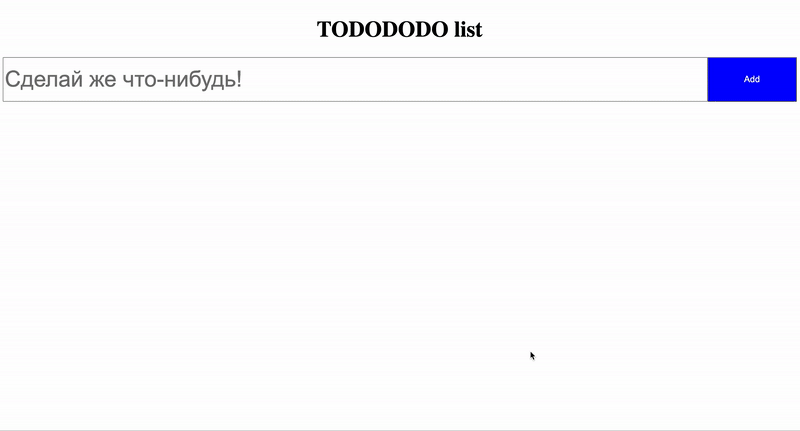

<!-- ### Emoji

---

1. Выша задача реализовать список эмоджи по следующим данным - [json](./emojiList.json)

Шаги по реализации:

- настройте рабочую директорию (вы можете использовать `create-react-app` или скопировать уже существующий реакт проект);
- компонент `EmojiItem` должен отображать иконку эмоджи и название:

  

- компонент `EmojiList` должен отображать список компонентов `EmojiItem`

**_Задание со звездочкой_**

Реализовать поиск emoji. Поиск должен работать как по `title` так и по `keywords`
Шаги по реализации:

- Добавить компонент Input для ввода текста
- Разместить его состояние. Можно размещать прямо внутри компонента Input (как мы делали с Form в туду листе),
  или разместить выше как мы это делали в компоненте Test
- Использовать filter для отрисовки списка

Пример поиска:

##  -->

### TodoList

---

1. Выша задача реализовать туду-лист (код заготовки [здесь](./todo-app)). Каждая тудушка должна иметь слудующий функционал:
- Кнопка Done, которая переводит тудушку в стадию выполненная (текст зачеркнутый, текст кнопки меняется на Do,и вся карточка должна быть подсвечена)
- Кнопка крестик, которая удаляет тудушку (уже реализовано вот [здесь](./todo-app), остальные кнопки делать по образу и подобию)
- Двойное нажатие на тудушку должно выделить ее (в [примере](./todo-app.gif) будет выделено желтым цветом)

Ниже списка тудушек разместить 2 кнопки (в [примере](./todo-app.gif) это remove selected и done selected), по нажатию на которые 
соответственно будут удалены или переведеные в done все выделенные.
У каждого должен быть свой персональные дизайн, так что проявите фантазию=)

Туду лист должен работать вот так:
## 

**_Задания со звездочкой_**

- Добавить возможность редактирования тудушки
- Добавить 3 кнопки для фильтрации списка: Все, Выполненные, Невыполненные

[Гайд по выпонению домашнего задания](../homework-guidelines.md)

### Читать

- [Подъём состояния](https://ru.reactjs.org/docs/lifting-state-up.html)
- [Еще разок про списки и ключи](https://ru.reactjs.org/docs/lists-and-keys.html)
- [Условный рендеринг](https://ru.reactjs.org/docs/conditional-rendering.html)
- [Композиция против наследования](https://ru.reactjs.org/docs/composition-vs-inheritance.html)
- [Философия React](https://ru.reactjs.org/docs/thinking-in-react.html)
