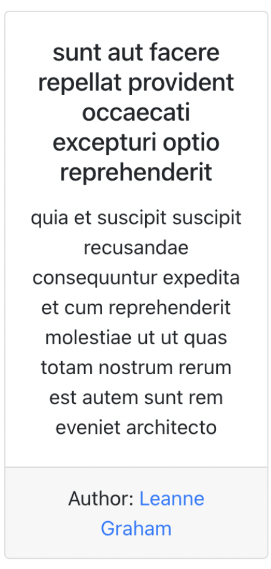
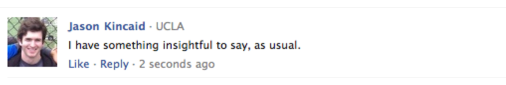
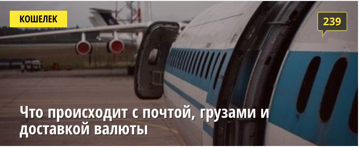

###

---

### ВНИМАНИЕ!!!!!!

## Для всех заданий используем один реакт проект (вы можете использовать `create-react-app` или скопировать уже существующий реакт проект).

## Каждое задание должно находиться в отдельной папке и разместить каждое задание в App.js разделив их тегом h1

#### Практика разработки простых компонентов

1. Сделать компонент поста с его автором. Компонент должен принимать следующие props: title, subtitle, author

   Компонент должен выглядеть так:
   

2. Сделать компонент поста с facebook. Компонент должен принимать
   следующие props: name, postDescription, location, timeText, функции onClickLike, onClickReply

Компонент должен выглядеть так:

3. Сделать компонент баннера с onliner. Компонент должен принимать
   следующие props: title, backgroundImageUrl, category, commentCount, функцию onClick

   Компонент должен выглядеть так:
   

   ## Все компоненты должны быть близкие (а то и один в один) по дизайну как на картинке, в пулл реквесте обязательно добавить скриншот готовых компонентов

   ### Converter (задание со звездочкой)

   Реализовать миниприложение конвертер валют с доллара в рубли и обратно. Конвертация должна происходить мгновенно.
   Финальный вид приложения должен выглядеть так:

   

[Гайд по выпонению домашнего задания](../homework-guidelines.md)

### Читать

- [Подъем состояния еще раз](https://ru.reactjs.org/docs/lifting-state-up.html)
- [Доступность контента](https://ru.reactjs.org/docs/accessibility.html)
- [Рефы](https://ru.reactjs.org/docs/refs-and-the-dom.html)
- [Словарь терминов React](https://ru.reactjs.org/docs/glossary.html)
- [Повторяем жизненный цикл компонента](https://ru.reactjs.org/docs/react-component.html)

  P.S. Обновите туду лист до последней версии. [Код туду листа](./todo-app)
