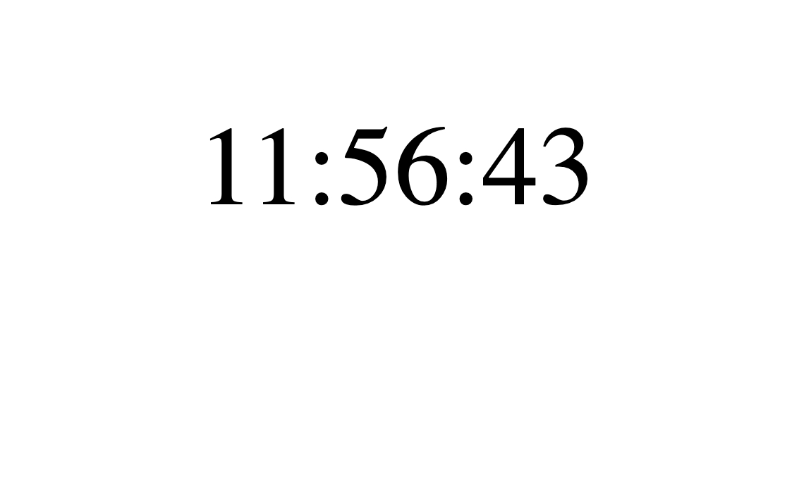

###
<!-- 
---

### ВНИМАНИЕ!!!!!!

## Для всех заданий используем один реакт проект (вы можете использовать `create-react-app` или скопировать уже существующий реакт проект).

## Каждое задание должно находиться в отдельной папке и разместить каждое задание в App.js разделив их тегом h1

#### Практика разработки простых компонентов -->

1. Сделать компонент поста с его автором. Компонент должен принимать следующие props: title, subtitle, author. Отобразить несколько карточек с использованием map 
   
   Компонент должен выглядеть так:
   

2. Сделать компонент поста с facebook. Компонент должен принимать 
   следующие props: name, postDescription, location, timeText, функции onClickLike, onClickReply. Отобразить несколько карточек с использованием map

Компонент должен выглядеть так:

3. Сделать компонент баннера с onliner. Компонент должен принимать
   следующие props: title, backgroundImageUrl, category, commentCount, функцию onClick. Отобразить несколько карточек с использованием map

   Компонент должен выглядеть так:
   

   ## Все компоненты должны быть близкие (а то и один в один) по дизайну как на картинке. 
   ## В пулл реквесте обязательно добавить скриншот готовых компонентов

4. Компонент для отображения времени:

 Шаги по выполнению

- создать компонент, которые показывает статическое [время](https://developer.mozilla.org/ru/docs/Web/JavaScript/Reference/Global_Objects/Date/toLocaleTimeString)
- 

5. Converter (задание со звездочкой)

   Реализовать миниприложение конвертер валют с доллара в рубли и обратно. Конвертация должна происходить мгновенно.
   Финальный вид приложения должен выглядеть так:

   

[Гайд по выпонению домашнего задания](../homework-guidelines.md)

### Читать

- [React. Введение](https://ru.reactjs.org/tutorial/tutorial.html#before-we-start-the-tutorial)
- [Компоненты и пропсы](https://ru.reactjs.org/docs/components-and-props.html)
- [useState](https://ru.reactjs.org/docs/hooks-state.html)
- [Использование состояния](https://ru.reactjs.org/docs/state-and-lifecycle.html#using-state-correctly)
- [Обработка событий](https://ru.reactjs.org/docs/handling-events.html)

  P.S. Обновите туду лист до последней версии. [Код туду листа](./todo-app)
