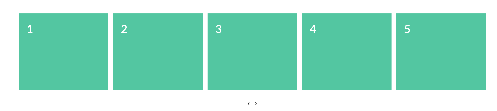

###

---

### ВНИМАНИЕ!!!!!!

## Для всех заданий используем один реакт проект (вы можете использовать `create-react-app` или скопировать уже существующий реакт проект).

#### 1. Знакомство с styled-components

Ваша задача ознакомиться с библиотекой [styled-components](https://styled-components.com/docs/basics#getting-started).
Добавить себе в проект при помощи npm install --save styled-components или воспользоваться подробным [гайдом](https://styled-components.com/docs/basics#installation). Как пользоваться написано [здесь](https://styled-components.com/docs/basics#getting-started).
Переделать при помощи styled-components компоненты поста, поста фейсбука, и банера с онлайнера, ссылка на [readme](./homework-4) того дз.

#### 2. Работа с компонентом модального окна

Ваша задача обновить список постов из [3-го урока по реакту](./homework-3). Используя компонент Modal,
который был сделан на занятии, код [здесь](./todo-app/src/Modal), реализовать следующий функционал:

- по нажатию на автора, должна выводится информация о пользователе в модальном окне
- сделать нормальный дизайн
- попрактиковаться в использовании [React Context](https://ru.reactjs.org/docs/context.html),
  например передовать в компонент Modal все пропсы через контекст

#### 3. Продолжаем знакомство с react-router-dom

Разобраться с [вложенными роутами](https://reactrouter.com/web/example/nesting)
и [параметрами url](https://reactrouter.com/web/example/url-params).
На занятии будем разбираться с этим по подробнее.

#### 4. Компонент карусель (звездочка)

Реализовать компонент похожий на [OwlCarousel](https://owlcarousel2.github.io/OwlCarousel2/demos/basic.html).
Управлять возможно только нажимая на стрелки, свайп в стороны не нужен.

[Гайд по выпонению домашнего задания](../homework-guidelines.md)

### Читать

- [React router примеры](https://reactrouter.com/web/example/basic)
- [React router компоненты](https://reactrouter.com/web/guides/primary-components)
- [JSX в подробных деталях](https://ru.reactjs.org/docs/jsx-in-depth.html)
- [React context](https://ru.reactjs.org/docs/context.html)
- [Redirect.React-Router](https://reactrouter.com/web/api/Redirect)
