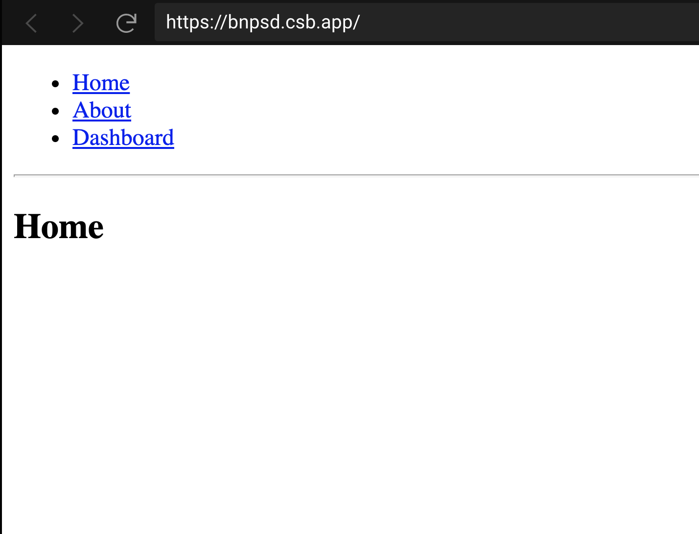

###

---

### ВНИМАНИЕ!!!!!!

## Для всех заданий используем один реакт проект (вы можете использовать `create-react-app` или скопировать уже существующий реакт проект).

#### 1. Знакомство с react-router-dom

Ваша задача ознакомиться с библиотекой [react-router-dom](https://reactrouter.com/web/example/basic).
Необходимо сделать галерею собственный приложений.

Шаги по реализации:

- установить библиотеку react-router-dom при помощи терминальной команды npm install react-router-dom
  (обращаю внимание, что проект должен быть открыт в vscode правильно, ориентиры: package.json, package-lock.json, node_modules),
  [более подробный гайд по установке](https://reactrouter.com/web/guides/quick-start)
- скопировать код ваших проектов и вставить их в папку lesson12/src/components и разместить в разные папке
- создать компонент CustomRouter, и там реализовать роутинг как в [примере](https://reactrouter.com/web/example/basic)
  (не забываем про импорт и использование всех приложений в этом компоненте).
- использовать компонент CustomRouter в App.js

#### 2. Дополнительная функция в todo list

Ваша задача доделать туду лист до последней версии, которую мы сделали на занятии, [код здесь](./todo-app).
Дополнительно надо реализовать следующий функционал:

- если не выделено ни одной тудушки, то кнопки 'Выполнить выделенные' и ' Удалить выделенные' должны быть задизэйблены
- добавить внизу списка текст 'Всего: ${количество всех созданных тудушек}', если тудушек нету, то не показывать текст
- добавить еще ниже текст 'Всего выполнено: ${количество всех выполненых(зачеркнутых) тудушек}', если выполненных нету, то не показывать
- создать свой уникальный дизайн туду листа =)

!Задание со звездочкой!

Сделать так, чтобы тудушки сохранялись после перезагрузки страницы.

[Гайд по выпонению домашнего задания](../homework-guidelines.md)

### Читать

- [React router примеры](https://reactrouter.com/web/example/basic)
- [React router компоненты](https://reactrouter.com/web/guides/primary-components)
- [Формы](https://ru.reactjs.org/docs/forms.html)
- [Неуправляемые компоненты](https://ru.reactjs.org/docs/uncontrolled-components.html)
- [JSX в подробных деталях](https://ru.reactjs.org/docs/jsx-in-depth.html)
