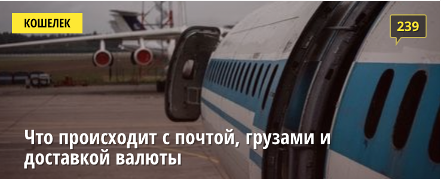

#### Для правильного выполнения д/з не забывайте следовать [гайдлайну](../homework-guidelines.md)
#### Для всех заданий используем один реакт проект (вы можете использовать `create-react-app` или скопировать уже существующий реакт проект).

### Практика разработки простых компонентов

#### 1
Сделать компонент поста с facebook.
Компонент должен выглядеть так:

#### 2
Сделать компонент баннера с onliner.
Компонент должен выглядеть так:

#### 3
Сделать пост предложения о работе с cайта rabota.by

#### 4
Сделать пост, который вам нравится, на выбор. Это может быть Instagram, VK, dev.by и тд или же задизайнить свой=).

## Все компоненты должны быть близкие (а то и один в один) по дизайну как на картинке, в пулл реквесте обязательно добавить скриншот готовых компонентов
## Все задания в App.js разделить тегом h1 с номером задания, все посты отрисовать при помощи map, также как мы это делали на занятии=)
## Код с занятия [тут](../todo-app)
### Читать

- [JSX](https://ru.reactjs.org/docs/introducing-jsx.html)
- [Рендеринг](https://ru.reactjs.org/docs/rendering-elements.html)
- [Компоненты и пропсы](https://ru.reactjs.org/docs/components-and-props.html)
- [React и CSS](https://ru.reactjs.org/docs/faq-styling.html)
- [Структура файлов](https://ru.reactjs.org/docs/faq-structure.html)
- [Обработка событий](https://ru.reactjs.org/docs/handling-events.html)
