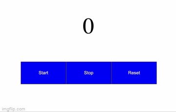

#### Таймер:

##### Как он должен работать:

- нажимая на кнопку `Start` таймер начинает свой отсчет;
- нажимая на кнопку `Stop` таймер останавливается;
- нажимая кнопку `Reset` таймер останавливается и возвращается в начальное значение `0`;

---

Финальное решение должно выглядеть так:

- 
